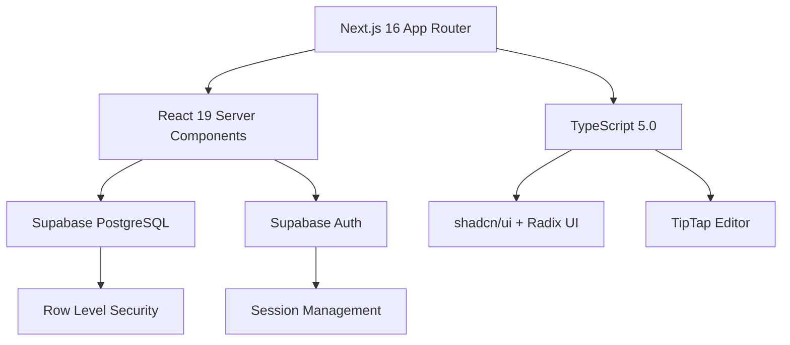

<div align="center">

# 🕎 אור הישרה - פלטפורמה רוחנית מתקדמת בעברית

### פלטפורמת תוכן רוחני מלאה עם מערכת קריאת טקסטים קדושים מתקדמת

[](https://nextjs.org/)
[](https://www.typescriptlang.org/)
[](https://supabase.com/)
[](https://opensource.org/licenses/MIT)

[תכונות](#-תכונות) • [התקנה](#️-התקנה) • [ארכיטקטורה](#️-ארכיטקטורה) • [תיעוד](#-תיעוד) • [תרומה](#-תרומה)

</div>

---

## 🌟 סקירה כללית

**אור הישרה** היא פלטפורמה רוחנית מתקדמת המשלבת בלוג תוכן עם מערכת קריאה ייחודית לטקסטים קדושים. הפרויקט בנוי על טכנולוגיות מתקדמות ומציע חוויית משתמש מושלמת בעברית עם תמיכה מלאה ב-RTL.

### 🎯 מה מייחד את הפרויקט?

- ⚡ **ביצועים מעולים** - React Server Components, caching חכם, optimistic updates
- 🔐 **אבטחה מתקדמת** - RLS policies, session management, rate limiting
- 📱 **Responsive נאטיבי** - עיצוב מושלם לכל גודל מסך
- 🧪 **איכות קוד גבוהה** - 100% TypeScript, unit tests, CI/CD pipeline
- ♿ **נגישות** - WCAG 2.1 AA compliance, keyboard navigation
- 🌐 **SEO מתקדם** - JSON-LD, Open Graph, XML Sitemap, RSS feeds

---

## 🚀 תכונות

### 📝 מערכת ניהול תוכן (CMS)

- **עורך טקסט עשיר** - TipTap editor עם תמיכה ב:
  - 📊 טבלאות עם סגנונות
  - 🖼️ העלאת תמונות עם drag & drop
  - 💻 בלוקי קוד עם syntax highlighting
  - 🎨 עיצוב טקסט מתקדם (צבעים, highlight, יישור)
  - 🔗 קישורים ורשימות
- **מערכת קטגוריות ותגיות** - ארגון תוכן גמיש ומתקדם
- **ניהול מאמרים** - טיוטות, פרסום, עריכה, ארכוב
- **מטא-דאטה מותאמת** - שדות מיוחדים לפרשת שבוע, תאריכים עבריים, שמות קודש

### 💬 מערכת תגובות חברתית

- **תגובות מקוננות** - עומק אינסופי של תשובות
- **מודרציה חכמה** - אישור, דחייה, סינון spam
- **התראות בזמן אמת** - עדכונים על תגובות חדשות
- **פרופילי משתמשים** - תמונות פרופיל, היסטוריית תגובות

### ⭐ מערכת דירוגים

- **דירוג 1-5 כוכבים** - עם חישוב ממוצע דינמי
- **מניעת הצבעה כפולה** - מערכת tracking מתקדמת
- **הצגה ויזואלית** - כוכבים אינטראקטיביים

### 📖 מערכת קריאת טקסטים קדושים (Text Reader)

מערכת גנרית ומתקדמת לקריאת טקסטים יהודיים עם תמיכה בכל הספרייה היהודית:

#### נתמך כיום:

1. **תהילים (Tehilim)** 🙏
   - 150 פרקים מלאים
   - קריאה מילה במילה עם הדגשת שמות הקודש
   - מעקב התקדמות מפורט
   - כוונות (intentions) לשמות הקודש

2. **תנ"ך (Tanakh)** 📜
   - תורה (5 ספרים), נביאים (21 ספרים), כתובים (13 ספרים)
   - 24 ספרים מלאים מתוך ספריית Sefaria
   - ניווט קל בין פרקים
   - שמירת מקום אחרון

3. **תלמוד בבלי (Talmud Bavli)** 📚
   - 2,711 דפים (37 מסכתות)
   - מסלול דף יומי (Daf Yomi) אוטומטי
   - חישוב מדויק על בסיס מחזור החדש (החל מ-5 בינואר 2020)
   - תמיכה בדף א' ודף ב'

4. **תפילות (Tefilot)** 🕊️
   - תפילת שחרית המלאה
   - ברכות יומיות
   - תפילות מיוחדות

5. **הלכה יומית (Daily Halacha)** 📖

6. **ספריית ספרים (Sefarim)** 📚
   - חיפוש בספריית Sefaria
   - גישה למשנה, זוהר, שולחן ערוך ועוד

#### תכונות מערכת הקריאה:

- ✨ **קריאה מילה במילה** - עם auto-advance מתכוונן (20-150 WPM)
- 📊 **מעקב התקדמות** - עם סנכרון Supabase + localStorage backup
- 📈 **סטטיסטיקות מפורטות**:
  - אחוז השלמה
  - מהירות קריאה (WPM)
  - זמן לימוד כולל
  - רצף ימים (current & longest streak)
  - זמן משוער להשלמה
- 🎨 **התאמה אישית**:
  - גודל פונט (18-40px)
  - מהירות קריאה
  - מצב חשוך/בהיר
- 💾 **שמירה אוטומטית** - כל 3 שניות
- 📍 **חזרה למקום האחרון** - בכל עת
- 🎯 **הישגים ותגיות** - גיימיפיקציה של הלימוד

### 🔐 ניהול משתמשים ואבטחה

- **אימות מתקדם** - Supabase Auth עם email/password
- **ניהול הרשאות** - Admin, Editor, User roles
- **Row Level Security** - מדיניות אבטחה דינמית ברמת השורה
- **Session management** - Proxy middleware (Next.js 16)
- **פרופילים מותאמים** - תמונות, שם מלא, העדפות

### 🎨 עיצוב וחוויית משתמש

- **RTL נאטיבי** - עיצוב מלא בעברית מימין לשמאל
- **פונטים עבריים** - Heebo ו-Frank Ruhl Libre
- **מצב כהה/בהיר** - מעבר חלק עם next-themes
- **עיצוב מודרני** - shadcn/ui components עם Radix UI
- **אנימציות** - תנועות חלקות ונעימות

### 🔍 SEO ונגישות

- **מטא-דאטה מלאה** - Open Graph, Twitter Cards
- **JSON-LD Schemas** - Organization, WebSite, Article
- **XML Sitemap** - דינמי עם עדכון אוטומטי
- **RSS & JSON Feeds** - לקוראי הזנות
- **Robots.txt** - אופטימיזציה לסורקים
- **Semantic HTML** - מבנה נכון ונגיש

---

## 📋 דרישות מערכת

### דרישות מינימום

| רכיב | גרסה מינימלית | מומלץ |
|------|---------------|-------|
| Node.js | 18.x | 20.x LTS |
| npm | 9.x | 10.x |
| PostgreSQL | 14+ | 15+ (via Supabase) |
| זיכרון RAM | 2GB | 4GB+ |
| מערכת הפעלה | Linux, macOS, Windows | Linux/macOS |

### חשבונות נדרשים (חינם)

- [Supabase](https://supabase.com) - מסד נתונים ואימות
- [Vercel](https://vercel.com) (אופציונלי) - deployment

---

## ⚙️ התקנה

### שלב 1: שכפול הפרויקט

```bash
git clone https://github.com/your-username/tefilot-app.git
cd tefilot-app
```

### שלב 2: התקנת תלויות

```bash
# עם npm
npm install

# עם pnpm (מומלץ - מהיר יותר)
pnpm install

# אם אתה על Termux/Android:
npm install --no-bin-links
```

### שלב 3: הגדרת משתני סביבה

1. **צור קובץ `.env.local`** בשורש הפרויקט:

```bash
cp .env.example .env.local
```

2. **ערוך את `.env.local`** והוסף את פרטי Supabase שלך:

```env
# Supabase Configuration
NEXT_PUBLIC_SUPABASE_URL=https://your-project-id.supabase.co
NEXT_PUBLIC_SUPABASE_ANON_KEY=your-anon-key-here

# Site Configuration
NEXT_PUBLIC_SITE_URL=http://localhost:3000

# Optional - Google Site Verification
GOOGLE_SITE_VERIFICATION=your-verification-code
```

**📍 איפה מוצאים את המפתחות?**
1. היכנס ל-[Supabase Dashboard](https://app.supabase.com)
2. בחר את הפרויקט שלך
3. לך ל-Settings → API
4. העתק את:
   - `Project URL` → `NEXT_PUBLIC_SUPABASE_URL`
   - `anon/public` key → `NEXT_PUBLIC_SUPABASE_ANON_KEY`

### שלב 4: הגדרת מסד הנתונים

#### 4.1 יצירת הטבלאות

הרץ את הסקריפטים הבאים ב-Supabase SQL Editor **לפי הסדר**:

```bash
supabase/migrations/
├── 001-create-tables.sql              # טבלאות בסיסיות
├── 002-seed-categories.sql            # קטגוריות ראשוניות
├── 004-create-tags-table.sql          # מערכת תגיות
├── 004-create-tehilim-cache.sql       # cache לתהילים
├── 006-create-auth-tables.sql         # טבלאות אימות
├── 009-optimize-rls-policies.sql      # מדיניות אבטחה
├── 010-create-admin-user.sql          # משתמש admin ראשוני
├── 011-create-profile-avatars-bucket.sql  # bucket לתמונות פרופיל
├── 015-create-article-images-bucket.sql   # bucket לתמונות מאמרים
└── 20250115_create_reading_progress.sql   # מעקב קריאה
```

**⚠️ חשוב:** ערוך את `010-create-admin-user.sql` **לפני** ההרצה והחלף את:
- `your-email@example.com` באימייל שלך
- `your-secure-password` בסיסמה חזקה

#### 4.2 יצירת Storage Buckets

הבטיחו שה-buckets הבאים קיימים ב-Supabase Storage:
- `avatars` - תמונות פרופיל (public)
- `article-images` - תמונות מאמרים (public)

### שלב 5: הרצת הפרויקט

```bash
# Development mode (עם hot-reload)
npm run dev

# Production build
npm run build
npm start
```

האתר יהיה זמין ב-`http://localhost:3000` 🎉

---

## 🏗️ ארכיטקטורה

### סטאק טכנולוגי



### מבנה תיקיות

```
tefilot-app/
│
├── app/                          # Next.js 16 App Router
│   ├── (public)/                 # מסלולים ציבוריים
│   │   ├── page.tsx             # דף הבית
│   │   ├── articles/            # מאמרים
│   │   ├── category/[slug]/     # קטגוריות
│   │   ├── tehilim/             # קורא תהילים
│   │   ├── tanakh/              # קורא תנ"ך
│   │   ├── talmud/              # קורא תלמוד
│   │   ├── tefilot/             # תפילות
│   │   └── learn/               # מרכז הלימוד
│   │
│   ├── admin/                    # ממשק ניהול (מוגן)
│   │   ├── layout.tsx           # Layout עם בדיקת הרשאות
│   │   ├── articles/            # ניהול מאמרים
│   │   ├── categories/          # ניהול קטגוריות
│   │   ├── comments/            # מודרציה
│   │   ├── users/               # ניהול משתמשים
│   │   ├── statistics/          # סטטיסטיקות
│   │   └── content-settings/    # הגדרות תוכן
│   │
│   ├── auth/                     # אימות
│   │   ├── login/
│   │   ├── register/
│   │   ├── forgot-password/
│   │   └── reset-password/
│   │
│   ├── api/                      # API Routes
│   │   ├── search/              # חיפוש
│   │   ├── auth/callback/       # OAuth callback
│   │   ├── tehilim/             # API תהילים
│   │   └── proxy/               # Proxy endpoint
│   │
│   ├── profile/                  # פרופיל משתמש
│   ├── settings/                 # הגדרות משתמש
│   ├── rss.xml/                  # RSS feed
│   ├── feed.json/                # JSON feed
│   ├── sitemap.ts                # XML sitemap
│   ├── robots.ts                 # robots.txt
│   ├── layout.tsx                # Root layout
│   └── globals.css               # Global styles
│
├── components/                   # React Components
│   ├── admin/                   # קומפוננטות ניהול
│   │   ├── article-form.tsx
│   │   ├── image-upload.tsx
│   │   └── ...
│   ├── articles/                # קומפוננטות מאמרים
│   │   ├── article-card.tsx
│   │   ├── article-grid.tsx
│   │   └── ...
│   ├── auth/                    # טפסי אימות
│   │   ├── login-form.tsx
│   │   ├── register-form.tsx
│   │   └── ...
│   ├── comments/                # מערכת תגובות
│   │   ├── comment-item.tsx
│   │   ├── comment-form.tsx
│   │   └── ...
│   ├── home/                    # דף הבית
│   │   ├── hero-section.tsx
│   │   ├── featured-articles.tsx
│   │   └── ...
│   ├── layout/                  # Layout components
│   │   ├── header.tsx
│   │   ├── footer.tsx
│   │   ├── navigation.tsx
│   │   └── ...
│   ├── profile/                 # פרופיל
│   ├── ratings/                 # דירוגים
│   ├── reader/                  # קורא טקסטים
│   │   ├── generic-text-reader.tsx
│   │   ├── verse-display.tsx
│   │   ├── reader-controls.tsx
│   │   └── stats-display.tsx
│   ├── seo/                     # SEO components
│   │   ├── json-ld.tsx
│   │   └── ...
│   ├── settings/                # הגדרות
│   ├── shared/                  # משותף
│   ├── tehilim/                 # תהילים
│   └── ui/                      # shadcn/ui primitives
│       ├── button.tsx
│       ├── card.tsx
│       ├── input.tsx
│       └── ... (40+ components)
│
├── lib/                          # Libraries & Utilities
│   ├── supabase/                # Supabase clients
│   │   ├── server.ts            # Server-side client
│   │   ├── client.ts            # Client-side client
│   │   └── proxy.ts             # Proxy client
│   ├── sefaria/                 # Sefaria API integration
│   │   ├── client.ts            # Generic API client
│   │   ├── tanakh.ts            # תנ"ך structure
│   │   └── talmud.ts            # תלמוד + Daf Yomi
│   ├── reader/                  # Text reader logic
│   │   └── progress-tracker.ts # Progress tracking
│   ├── tehilim/                 # Tehilim-specific
│   │   ├── sefaria.ts
│   │   ├── cache.ts
│   │   └── ...
│   ├── queries.ts               # Database queries
│   ├── seo.ts                   # SEO utilities
│   └── utils.ts                 # General utilities
│
├── types/                        # TypeScript Types
│   ├── index.ts                 # Main types
│   ├── auth.ts                  # Auth types
│   └── text-reader.ts           # Text reader types
│
├── hooks/                        # Custom React Hooks
│   ├── use-toast.tsx
│   └── ...
│
├── supabase/migrations/          # Database Migrations
│   └── *.sql
│
├── tests/                        # Unit Tests
│   ├── setup.ts                 # Test configuration
│   └── lib/
│       └── sefaria/
│           ├── client.test.ts
│           └── talmud.test.ts
│
├── .github/workflows/            # CI/CD
│   └── ci.yml                   # GitHub Actions
│
├── .husky/                       # Git Hooks
│   └── pre-commit               # Pre-commit hook
│
├── public/                       # Static Assets
│   └── ...
│
├── eslint.config.mjs            # ESLint configuration
├── vitest.config.ts             # Vitest configuration
├── next.config.mjs              # Next.js configuration
├── tailwind.config.ts           # Tailwind CSS
├── tsconfig.json                # TypeScript config
├── components.json              # shadcn/ui config
├── package.json                 # Dependencies & Scripts
├── CLAUDE.md                    # Technical documentation
└── README.md                    # זה הקובץ!
```

### שכבות האפליקציה

```
┌─────────────────────────────────────────────┐
│        UI Layer (React Components)          │
│  - Server Components (fetch data)           │
│  - Client Components (interactivity)        │
└─────────────────────────────────────────────┘
                    ↕
┌─────────────────────────────────────────────┐
│       Business Logic Layer (lib/)           │
│  - queries.ts (data fetching)               │
│  - reader/progress-tracker.ts (logic)       │
│  - sefaria/* (external API)                 │
└─────────────────────────────────────────────┘
                    ↕
┌─────────────────────────────────────────────┐
│      Data Layer (Supabase PostgreSQL)       │
│  - RLS Policies (security)                  │
│  - Functions & Triggers                     │
│  - Storage Buckets                          │
└─────────────────────────────────────────────┘
```

### דפוסי עיצוב מרכזיים

#### 1. Server Components First
```typescript
// ברירת המחדל - Server Component
async function ArticlePage({ params }: { params: { slug: string } }) {
  const article = await getArticleBySlug(params.slug) // שליפה בשרת
  return <ArticleView article={article} />
}
```

#### 2. Server Actions לפעולות
```typescript
"use server"

export async function createComment(formData: FormData) {
  const supabase = await createClient()
  const { data, error } = await supabase
    .from("comments")
    .insert({ /* ... */ })

  revalidatePath("/articles/[slug]")
  return { data, error }
}
```

#### 3. Optimistic Updates
```typescript
"use client"

async function handleLike() {
  // עדכון UI מיידי
  setLiked(true)
  setCount(count + 1)

  // שליחה לשרת ברקע
  await likeArticle(articleId)
}
```

#### 4. Progressive Enhancement
```typescript
// עובד בלי JavaScript, משתפר עם JavaScript
<form action={serverAction}>
  <button type="submit">שלח</button>
</form>
```

---

## 🧪 איכות קוד ובדיקות

### סטטוס איכות

```
✅ ESLint:        0 errors, 0 warnings
✅ TypeScript:    Strict mode enabled
✅ Tests:         25/25 passing
✅ Coverage:      Core modules covered
✅ Pre-commit:    Automated checks
✅ CI/CD:         GitHub Actions
```

### הרצת בדיקות

```bash
# ESLint - בדיקת איכות קוד
npm run lint              # בדיקה בלבד
npm run lint:fix          # תיקון אוטומטי

# TypeScript - בדיקת טיפוסים
npm run type-check        # בדיקה בלבד (לא חוסם build)

# Vitest - Unit Tests
npm test                  # הרצת כל הבדיקות
npm run test:watch        # מצב watch (מריץ מחדש בשינויים)
npm run test:ui           # ממשק UI אינטראקטיבי
npm run test:coverage     # דוח כיסוי קוד מפורט

# הרצת הכל ביחד
npm run lint && npm run type-check && npm test -- --run
```

### Pre-commit Hooks

הפרויקט משתמש ב-**Husky** ו-**lint-staged** להרצת בדיקות אוטומטיות לפני כל commit:

```bash
# מה קורה אוטומטית בכל git commit:
1. Husky מאתר קבצים שהשתנו
2. lint-staged מריץ ESLint על קבצים שהשתנו בלבד
3. ESLint מתקן אוטומטית בעיות קלות
4. אם יש שגיאות - הcommit נחסם
5. אם הכל תקין - הcommit עובר ✅
```

### GitHub Actions CI/CD

Pipeline אוטומטי שרץ על כל push/PR:

```yaml
שלבי הבדיקה:
├── 📦 Install dependencies (npm ci)
├── 🔍 Lint (npm run lint)
├── 📘 Type check (npm run type-check)
├── 🧪 Unit tests (npm test)
├── 📊 Coverage report (npm run test:coverage)
└── 🏗️ Build (npm run build)

מטריצת בדיקות:
- Node.js 18.x
- Node.js 20.x
```

**קובץ הגדרה:** `.github/workflows/ci.yml`

---

## 👨‍💻 מדריך פיתוח

### התחלת עבודה על feature חדש

```bash
# 1. יצירת branch חדש
git checkout -b feature/amazing-feature

# 2. עבודה על הקוד
# ... write code ...

# 3. בדיקות מקומיות
npm run lint
npm test
npm run build

# 4. Commit (pre-commit hooks ירוצו אוטומטית)
git add .
git commit -m "feat: add amazing feature"

# 5. Push
git push origin feature/amazing-feature

# 6. פתיחת Pull Request ב-GitHub
```

### קונבנציות קוד

#### מבנה קבצים
```
feature-name/
├── page.tsx              # Server Component (ברירת מחדל)
├── client-component.tsx  # Client Component (with "use client")
├── actions.ts            # Server Actions (with "use server")
└── types.ts              # TypeScript types
```

#### נוהלי כתיבה

**✅ DO:**
```typescript
// שימוש בטיפוסים מפורשים
interface User {
  id: string
  name: string
  email: string
}

// פונקציות עם JSDoc
/**
 * שולף מאמר לפי slug
 * @param slug - מזהה ייחודי של המאמר
 * @returns המאמר או null
 */
async function getArticleBySlug(slug: string): Promise<Article | null> {
  // ...
}

// שימוש ב-early returns
if (!user) {
  return null
}
// המשך הלוגיקה...
```

**❌ DON'T:**
```typescript
// הימנעות מ-any
function fetchData(): any { } // ❌

// הימנעות מ-nested ternaries
const value = condition1 ? value1 : condition2 ? value2 : value3 // ❌

// הימנעות מקוד מת
if (false) {
  // dead code
} // ❌
```

#### שמות משתנים

```typescript
// קומפוננטות - PascalCase
const ArticleCard = () => { }

// פונקציות/משתנים - camelCase
const getUserName = () => { }
const userName = "John"

// קבועים - UPPER_SNAKE_CASE
const MAX_ARTICLES = 100
const API_BASE_URL = "https://api.example.com"

// טיפוסים/אינטרפייסים - PascalCase
type Article = { }
interface UserProfile { }

// פרטי (private) - קידומת underscore (אופציונלי)
const _internalHelper = () => { }
```

### הוספת קומפוננטת UI חדשה

```bash
# דרך shadcn/ui
npx shadcn@latest add <component-name>

# דוגמאות:
npx shadcn@latest add dialog
npx shadcn@latest add dropdown-menu
npx shadcn@latest add tooltip

# רשימת כל הקומפוננטות הזמינות:
npx shadcn@latest add
```

### עבודה עם Supabase

#### שימוש ב-Server Components
```typescript
import { createClient } from "@/lib/supabase/server"

async function ServerComponent() {
  const supabase = await createClient()
  const { data } = await supabase
    .from("articles")
    .select("*")
    .eq("status", "published")

  return <div>{/* render data */}</div>
}
```

#### שימוש ב-Client Components
```typescript
"use client"

import { createClient } from "@/lib/supabase/client"

function ClientComponent() {
  const supabase = createClient()

  const handleClick = async () => {
    const { data } = await supabase
      .from("articles")
      .select("*")
  }
}
```

### דיבוג

```typescript
// Development mode - לוגים מפורטים
if (process.env.NODE_ENV === "development") {
  console.log("Debug info:", data)
}

// שימוש ב-React DevTools
// התקנה: https://react.dev/learn/react-developer-tools

// שימוש ב-Supabase Studio
// גישה: https://app.supabase.com/project/[project-id]
```

---

## 🌐 Deploy לייצור

### Vercel (מומלץ)

הפרויקט מותאם ל-Vercel ועובד out-of-the-box:

```bash
# 1. התקנת Vercel CLI (אופציונלי)
npm install -g vercel

# 2. Deploy מהטרמינל
vercel

# או דרך GitHub:
# 1. Push לGitHub
# 2. חבר את הrepository ב-vercel.com
# 3. Deploy אוטומטי בכל push
```

**הגדרות Vercel:**
```bash
Framework Preset: Next.js
Build Command: npm run build
Output Directory: .next
Install Command: npm install

Environment Variables:
├── NEXT_PUBLIC_SUPABASE_URL
├── NEXT_PUBLIC_SUPABASE_ANON_KEY
├── NEXT_PUBLIC_SITE_URL (חשוב! URL הייצור)
└── GOOGLE_SITE_VERIFICATION (אופציונלי)
```

### Docker (אופציונלי)

```dockerfile
# Dockerfile
FROM node:20-alpine AS base

# Dependencies
FROM base AS deps
WORKDIR /app
COPY package*.json ./
RUN npm ci

# Builder
FROM base AS builder
WORKDIR /app
COPY --from=deps /app/node_modules ./node_modules
COPY . .
RUN npm run build

# Runner
FROM base AS runner
WORKDIR /app
ENV NODE_ENV production

COPY --from=builder /app/public ./public
COPY --from=builder /app/.next/standalone ./
COPY --from=builder /app/.next/static ./.next/static

EXPOSE 3000
ENV PORT 3000

CMD ["node", "server.js"]
```

```bash
# Build & Run
docker build -t tefilot-app .
docker run -p 3000:3000 --env-file .env.local tefilot-app
```

### שיקולי ייצור

- [ ] עדכן `NEXT_PUBLIC_SITE_URL` ל-URL הסופי
- [ ] הפעל HTTPS (Vercel עושה זאת אוטומטית)
- [ ] הגדר rate limiting ב-Supabase
- [ ] הגדר backups למסד הנתונים
- [ ] הפעל monitoring (Vercel Analytics / Sentry)
- [ ] בדוק ביצועים ב-Lighthouse (מטרה: 90+)
- [ ] הגדר Domain מותאם אישית
- [ ] הגדר email templates ב-Supabase Auth

---

## 📚 תיעוד נוסף

### קבצי תיעוד

| קובץ | תיאור |
|------|-------|
| [CLAUDE.md](CLAUDE.md) | תיעוד טכני מפורט של הארכיטקטורה |
| [CONTRIBUTING.md](CONTRIBUTING.md) | מדריך תרומה לפרויקט |
| [CHANGELOG.md](CHANGELOG.md) | היסטוריית שינויים |
| [LICENSE](LICENSE) | רישיון MIT |

### משאבים חיצוניים

- 📘 [Next.js 16 Documentation](https://nextjs.org/docs)
- 🗄️ [Supabase Documentation](https://supabase.com/docs)
- 🎨 [shadcn/ui Components](https://ui.shadcn.com)
- 📖 [Sefaria API](https://www.sefaria.org/api/docs)
- 📝 [TipTap Editor](https://tiptap.dev)
- 🎭 [Radix UI Primitives](https://www.radix-ui.com/primitives)

---

## 🐛 בעיות נפוצות וטיפול בתקלות

### בעיות התקנה

<details>
<summary><strong>❌ "next: not found" על Termux/Android</strong></summary>

**הסיבה:** Termux לא תומך ב-symlinks.

**פתרון:**
```bash
npm install --no-bin-links
```
</details>

<details>
<summary><strong>❌ שגיאות EACCES/Permission Denied</strong></summary>

**הסיבה:** הרשאות קבצים לא נכונות.

**פתרון:**
```bash
# Linux/macOS
sudo chown -R $USER:$USER .
sudo chmod -R 755 node_modules

# אם זה לא עוזר, נקה ונסה שוב:
rm -rf node_modules package-lock.json
npm install
```
</details>

### בעיות Supabase

<details>
<summary><strong>❌ שגיאות Session / "Invalid JWT"</strong></summary>

**סיבות אפשריות:**
1. משתני סביבה לא מוגדרים נכון
2. Proxy middleware לא פועל
3. Session expired

**פתרון:**
```bash
# 1. בדוק משתני סביבה
echo $NEXT_PUBLIC_SUPABASE_URL
echo $NEXT_PUBLIC_SUPABASE_ANON_KEY

# 2. וודא ש-proxy.ts קיים בapp/
ls -la app/proxy.ts

# 3. נקה cookies ו-localStorage
# פתח DevTools → Application → Clear storage

# 4. Restart dev server
npm run dev
```
</details>

<details>
<summary><strong>❌ RLS Policy Errors</strong></summary>

**הסיבה:** Row Level Security חוסם גישה.

**פתרון:**
```sql
-- בדוק policies ב-Supabase SQL Editor:
SELECT * FROM pg_policies WHERE tablename = 'articles';

-- אפשרות זמנית (לא מומלץ לייצור!):
ALTER TABLE articles DISABLE ROW LEVEL SECURITY;
```
</details>

### בעיות Build

<details>
<summary><strong>❌ TypeScript Errors בbuild</strong></summary>

**הסיבה:** הפרויקט מוגדר עם `ignoreBuildErrors: true` אבל יש שגיאות.

**פתרון:**
```bash
# בדוק שגיאות טיפוסים
npm run type-check

# תקן את השגיאות או (זמנית):
# next.config.mjs:
typescript: {
  ignoreBuildErrors: true,  // כבר קיים
}
```
</details>

<details>
<summary><strong>❌ Out of Memory Errors</strong></summary>

**הסיבה:** Build דורש זיכרון רב.

**פתרון:**
```bash
# הגדל את ה-heap size:
NODE_OPTIONS="--max-old-space-size=4096" npm run build
```
</details>

### בעיות Text Reader

<details>
<summary><strong>❌ "Failed to fetch from Sefaria"</strong></summary>

**סיבות אפשריות:**
1. בעיית רשת
2. Sefaria API down (נדיר)
3. Reference שגוי

**פתרון:**
```typescript
// בדוק את ה-reference:
// ✅ נכון: "Genesis.1", "Psalms.23", "Berakhot.2a"
// ❌ שגוי: "Genesis 1", "Tehilim.23", "Berachot 2a"

// בדוק connectivity:
fetch("https://www.sefaria.org/api/texts/Genesis.1")
  .then(r => r.json())
  .then(console.log)
```
</details>

### בעיות Performance

<details>
<summary><strong>⚠️ האתר איטי / High TTI</strong></summary>

**פתרונות:**
```typescript
// 1. השתמש ב-Server Components כשאפשר
// ❌ לא מומלץ:
"use client"
const ArticlePage = () => { ... }

// ✅ מומלץ:
async function ArticlePage() { ... }

// 2. Dynamic imports לקומפוננטות כבדות:
const Editor = dynamic(() => import("@/components/editor"), {
  ssr: false,
  loading: () => <Skeleton />
})

// 3. Image optimization:
<Image
  src="/image.jpg"
  width={800}
  height={600}
  quality={85}
  loading="lazy"
/>

// 4. Database indexes (Supabase):
CREATE INDEX idx_articles_status ON articles(status);
CREATE INDEX idx_articles_created_at ON articles(created_at DESC);
```
</details>

### קבלת עזרה

אם נתקעת:
1. 🔍 **חפש ב-Issues** - אולי מישהו נתקל באותה בעיה
2. 📖 **קרא את התיעוד** - CLAUDE.md מכיל מידע טכני מפורט
3. 💬 **פתח Issue חדש** - תאר את הבעיה בפירוט + screenshots
4. 📧 **צור קשר** - [your-email@example.com]

---

## 🤝 תרומה לפרויקט

אנחנו שמחים לקבל תרומות! 🎉

### דרכי תרומה

- 🐛 **דיווח על באגים** - פתח Issue עם תיאור מפורט
- 💡 **רעיונות לתכונות חדשות** - פתח Discussion
- 📝 **תיקוני תיעוד** - כל שיפור בתיעוד מתקבל בברכה
- 🔧 **Pull Requests** - תיקוני באגים, תכונות חדשות, שיפורים

### תהליך התרומה

1. **Fork את הפרויקט**
   ```bash
   # לחץ על "Fork" ב-GitHub
   ```

2. **שכפל את ה-fork שלך**
   ```bash
   git clone https://github.com/your-username/tefilot-app.git
   cd tefilot-app
   ```

3. **צור branch חדש**
   ```bash
   git checkout -b feature/amazing-feature
   # או:
   git checkout -b fix/bug-description
   ```

4. **עשה את השינויים**
   ```bash
   # ערוך קבצים...

   # בדוק שהכל עובד:
   npm run lint
   npm test
   npm run build
   ```

5. **Commit השינויים**
   ```bash
   git add .
   git commit -m "feat: add amazing feature"

   # Commit message format:
   # feat: תכונה חדשה
   # fix: תיקון באג
   # docs: עדכון תיעוד
   # style: שינויי עיצוב/פורמט
   # refactor: שינוי קוד ללא שינוי פונקציונליות
   # test: הוספת/תיקון בדיקות
   # chore: עדכונים כלליים
   ```

6. **Push לGitHub**
   ```bash
   git push origin feature/amazing-feature
   ```

7. **פתח Pull Request**
   - לך ל-GitHub repository שלך
   - לחץ "Compare & pull request"
   - תאר את השינויים בפירוט
   - המתן לreviews

### Code Review Process

1. ✅ **CI Pipeline** - בדיקות אוטומטיות
2. 👀 **Code Review** - maintainer יסקור את הקוד
3. 💬 **שיחה** - ייתכנו הערות/בקשות לשינויים
4. ✅ **Approval** - לאחר אישור
5. 🎉 **Merge** - הקוד ימוזג ל-main

### קוד התנהגות

- 🤝 היה מכבד ונעים
- 💡 קבל ביקורת באהבה
- 🌟 עזור לאחרים
- 📚 למד ולמד אחרים

---

## 📊 סטטוס הפרויקט

### גרסה נוכחית: v2.0.0

**תכונות שהושלמו:**
- ✅ מערכת CMS מלאה
- ✅ קורא טקסטים גנרי (תהילים, תנ"ך, תלמוד, תפילות)
- ✅ מערכת תגובות ודירוגים
- ✅ אימות ניהול משתמשים
- ✅ SEO מתקדם
- ✅ Testing infrastructure
- ✅ CI/CD pipeline
- ✅ 0 ESLint warnings

**בעבודה:**
- 🔄 פונקציית חיפוש מתקדמת
- 🔄 PWA support
- 🔄 התראות בזמן אמת
- 🔄 נושאי עיצוב נוספים

**תוכניות עתידיות:**
- 📅 אינטגרציה עם לוח עברי
- 📅 מערכת הזמנות/תורים
- 📅 פורום משתמשים
- 📅 אפליקציה ניידת (React Native)

---

## 📄 רישיון

הפרויקט הזה מופץ תחת רישיון MIT. ראה [LICENSE](LICENSE) לפרטים.

```
MIT License

Copyright (c) 2025 אור הישרה

Permission is hereby granted, free of charge, to any person obtaining a copy
of this software and associated documentation files...
```

---

## 🙏 תודות

הפרויקט הזה נבנה עם:

- 💙 [Next.js](https://nextjs.org) - React Framework
- 🗄️ [Supabase](https://supabase.com) - Backend as a Service
- 🎨 [shadcn/ui](https://ui.shadcn.com) - Component Library
- 📖 [Sefaria](https://www.sefaria.org) - Jewish Texts API
- 📝 [TipTap](https://tiptap.dev) - Rich Text Editor
- 🧪 [Vitest](https://vitest.dev) - Testing Framework

תודה מיוחדת לקהילת הקוד הפתוח! 🌟

---

## 📞 יצירת קשר

- 🌐 **אתר:** [https://your-site.com](https://your-site.com)
- 📧 **Email:** your-email@example.com
- 🐦 **Twitter:** [@your_handle](https://twitter.com/your_handle)
- 💬 **Discord:** [Join our server](https://discord.gg/your-invite)

---

<div align="center">

### ⭐ אם הפרויקט עזר לך, אנא תן לנו כוכב ב-GitHub!

**בנוי עם ❤️ בעברית • Made with ❤️ in Hebrew**

[⬆️ חזרה למעלה](#-אור-הישרה---פלטפורמה-רוחנית-מתקדמת-בעברית)

</div>
